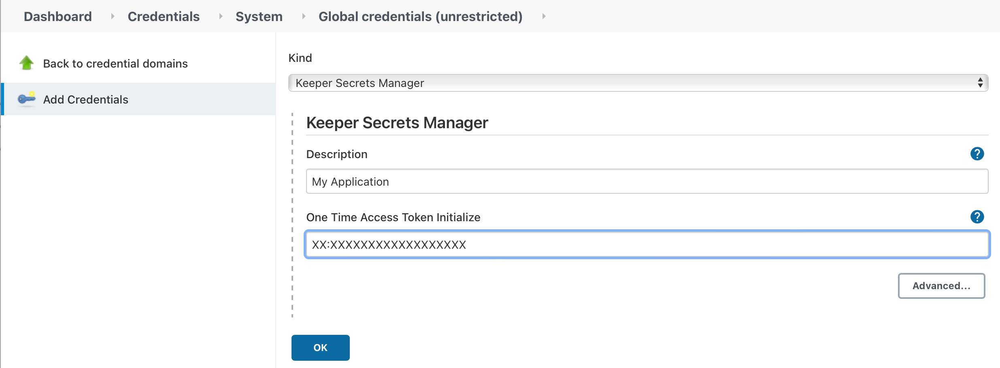
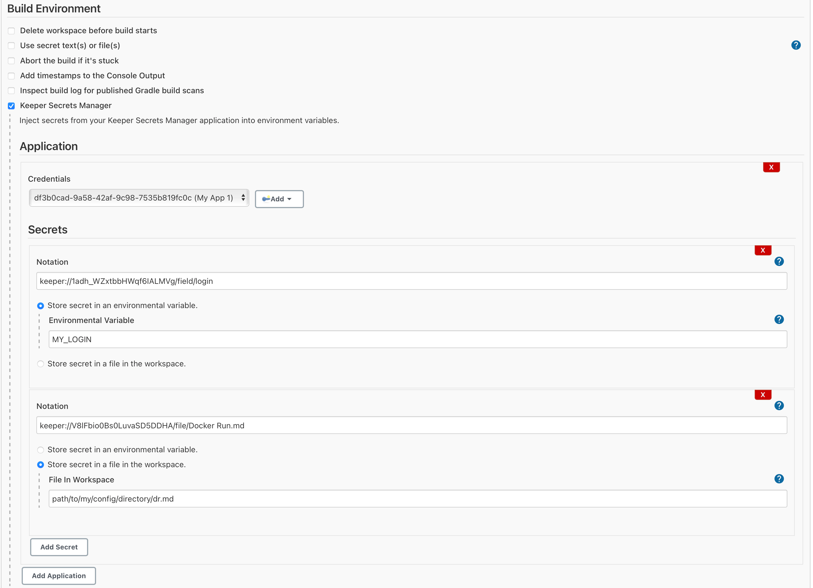

# keeper-secrets-manager

## Introduction

This plugin allows you retrieve secrets from the [Keeper Secrets Manager](https://www.keepersecurity.com) and place the values 
into environmental variables in the builder and pipeline.

## Getting started

### Getting Credentials

First, start a Jenkins instance with the keeper-secrets-manager plugin installed. You'll also need to install
[Keeper Commander](https://github.com/Keeper-Security/Commander/releases).

You can optionally install the [Keeper Secrets Manager CLI](https://app.gitbook.com/@keeper-security/s/secrets-manager/secrets-manager/secrets-manager-command-line-interface) 
to view records and their fields.

Keeper Commander will be used to generate the one time tokens used by the plugin.

    My Vault> secrets-manager client add --app MyApplication

    ------------------------------------------------------------------
    One Time Access Token: XXXXXXXXXXX
    ------------------------------------------------------------------

Documentation for Keeper Commander can be found [here](https://app.gitbook.com/@keeper-security/s/secrets-manager/commander-cli/overview).

Within of the Jenkins, navigate to **Manage Jenkins->Manage Credentials->(scope)->Add Credentials**, 
then select **Keeper Secrets Manager** in the **Kind** dropdown.

Cut-n-paste the One Time Access Token into the UI field, set the Hostname, and save the credential. Upon saving
the plugin will attempt to retrieve the required keys from the Keeper Secrets Manager server and populate them. When
you open the credential again, the One Time Access Token should be blank and clicking the View Keys button will
display your private and application key, and client id.

You can set a **Description** of the credentials to make it easily found in other parts of Jenkins.

If there was a problem redeeming the One Time Access Token, the error message will appear in the One Time Access Token
field.

### Builder

As part of the **Add build step** dropdown in a build's configuration, you'll find **Keeper Secrets Manager**. This
build step will allow you select a credential and add multiple secrets.

Per secret, an environmental variable name needs to be entered and [Keeper Notation](#keeper-notation) describing which
field in a record should be used for the value of the environmental variable is required.

## Keeper Notation

Keeper Notation is way to describe a field in a record and the parts of the field's value. It looks like the following:

    keeper://Ipk9NR1rCBZXyflWbPwTGA/field/login
    keeper://Ipk9NR1rCBZXyflWbPwTGA/custom_field/Lock Box Location
    keeper://Ipk9NR1rCBZXyflWbPwTGA/file/cat.png
    keeper://Ipk9NR1rCBZXyflWbPwTGA/custom_field/Content Phone[1][number]

Notation can be broken into three pieces: the record uid, the type of field in the record, and 
the field label, type or file name and access in to the values.

You can test notation using the Keeper Secrets Manager CLI

    $ ksm secret notation 

### The Record UID

Each record has a unique identifier which is obtainable from multiple tools.

In the Web UI, clicking the Info icon will show the Record UID.

In Commander, you can see the Record UID by issuing the _list_ command. 

    My Vault> list
      #  Record UID              Type       Title             ...
    ---  ----------------------  ---------  ----------------  ...
      1  Ipk9NR1rCBZXyflWbPwTGA  login      Web 1    
      2  6vV5bvyu5eLygHa3kMEWug  login      Web 2 
      3  Eq8KFpJkRkgOnpXjNIjYcA  login      Prod Database

In the CLI, you can see the
Record UID by running 

    $ ksm secret list
    UID                     Record Type          Title
    ----------------------- -------------------- -----------------
    A_7YpGBUgRTeDEQLhVRo0Q  file                 Tomcat Certs
    Atu8tVgMxpB-iO4xT-Vu3Q  login                Router Login
    A_7YpGBUgRTeDEQLhVRo0Q  file                 Company Logos

### The Field Type

There are three field types: **field**, **custom_field**, and **file**.
 
* **field** - Refers to the standard field you get for the record type. These are the
fields that appear at the top of the Web UI like **Login** and **Password**.
* **custom_field** - Refers to field added in the Custom Field section.
* **file** - Refers to the Files and Photo section.

### Field Label or File Name

For the **field** and **custom_field** field types, this would be the label shown in the Web UI. In Keeper Commander you can get
the details of the record using the "get &lt;RECORD UID&gt;" command, and via the CLI with 
**ksm secret get -u &lt;RECORD UID&gt;**.

    keeper://Atu8tVgMxpB-iO4xT-Vu3Q/field/login
    keeper://Atu8tVgMxpB-iO4xT-Vu3Q/field/password
    keeper://Atu8tVgMxpB-iO4xT-Vu3Q/custom_field/My Pad Lock Number

For the **file** field type, use the name of the file.

    keeper://A_7YpGBUgRTeDEQLhVRo0Q/file/server.xml

Only the Keeper Secrets Manager CLI will give a more detail view of the values in the record. For example, if you look
at a bank card record type you can see the **paymentCard** is more complex than just a literal value. It's actually
a dictionary of values.

    $  ksm secret get -u jW8FGAqf02Rlm-N1dr4vkA
    Record: jW8FGAqf02Rlm-N1dr4vkA
    Title: Payment Card Record
    Record Type: bankCard

    Field        Value
    ------------ --------------------------------------------------------------------
    paymentCard  [{"cardNumber": "5555555555555555", "cardExpirationDate": "01/2021", 
                 "cardSecurityCode": "543"}]
    text         Cardholder
    pinCode      ****
    addressRef   s73hd3L4cruuDc0iksdkxw

    Custom Field Type     Value
    ------------ -------- --------------
    Pin Code     pinCode  ****

To get the credit card number, the notation would look like this:

    keeper://jW8FGAqf02Rlm-N1dr4vkA/field/paymentCard[cardNumber]

## Issues

TODO Decide where you're going to host your issues, the default is Jenkins JIRA, but you can also enable GitHub issues,
If you use GitHub issues there's no need for this section; else add the following line:

Report issues and enhancements in the [Jenkins issue tracker](https://issues.jenkins-ci.org/).

## Contributing

TODO review the default [CONTRIBUTING](https://github.com/jenkinsci/.github/blob/master/CONTRIBUTING.md) file and make sure it is appropriate for your plugin, if not then add your own one adapted from the base file

Refer to our [contribution guidelines](https://github.com/jenkinsci/.github/blob/master/CONTRIBUTING.md)

## LICENSE

Licensed under MIT, see [LICENSE](LICENSE.md)

